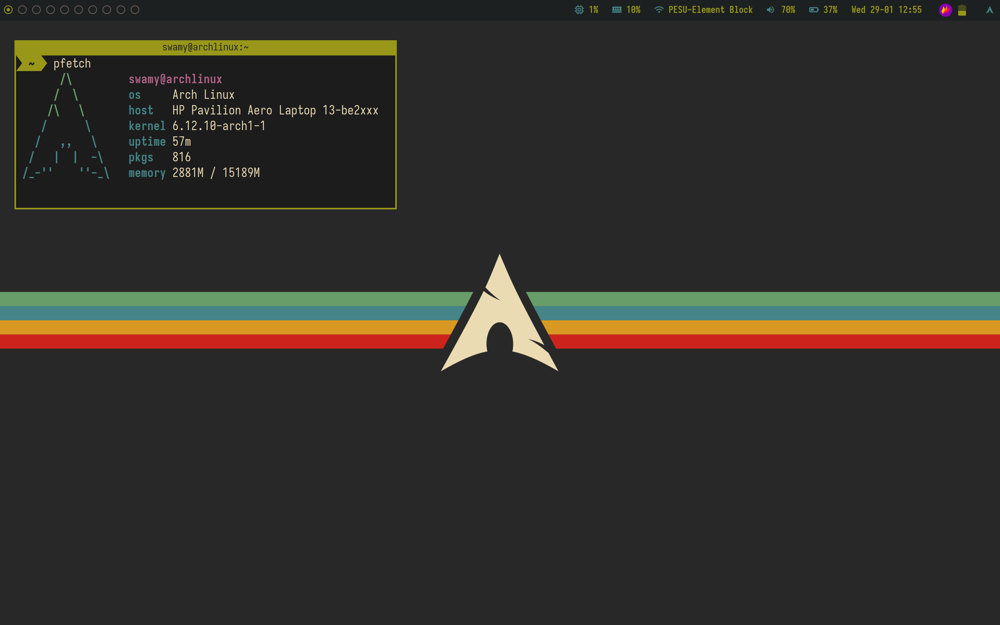

    <h1>berry</h1> 

A healthy, bite-sized window manager written in C over the XLib library.

My build of berrywm.

## Changes over original
* `next_workspace` and `previous_workspace` commands.

# Usage

For usage and documentation, please visit the project website [berrywm.org](https://berrywm.org)
